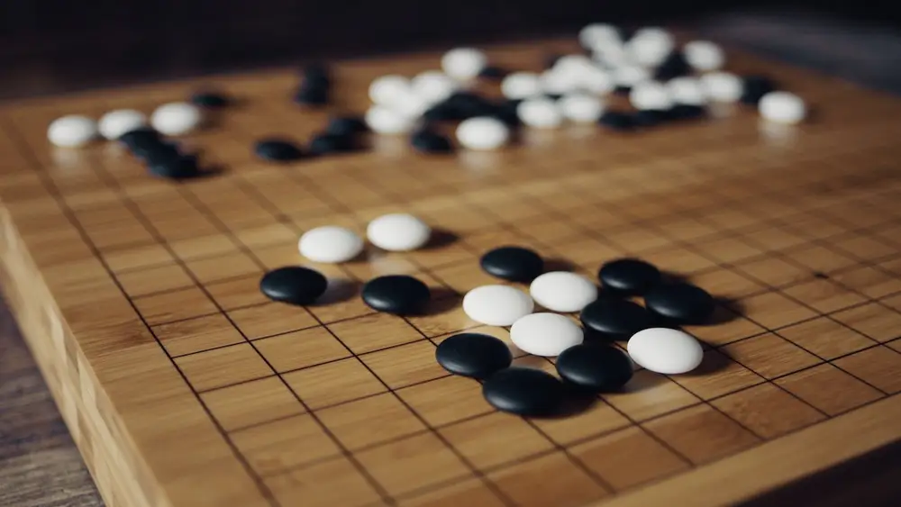

# Week four: Go :white_circle: :black_circle: :white_circle: :black_circle:

## Rules of Go

Go is a two player board game. The aim is to capture territory from your opponent :guardsman:. The player that has the most territory at the end of the game is the winner.
i
The rules of Go are complex and many different rule-sets exist. [Wikipedia](<https://en.wikipedia.org/wiki/Go_(game)>) has a good description of the rules so we won't rehash them here.

The rule-set we will use here are the [CGOS](http://www.yss-aya.com/cgos/) rules that allow two bots to play each other (as other forms of Go rely on agreements between human players).

Professional go is played on a 19x19 board, but we will use a 9x9 board so you don't need your own GPU farm :pig:!

Do not fret if you do not understand the rules fully, we will provide your bots with a list of legal moves for each turn!

### Starting and ending the game

Go starts with an empty board and black places the first stone. We will randomise which player is black on each game.

The game ends when both players pass.

### Scoring

As in the [CGOS](http://www.yss-aya.com/cgos/) rules, we will use [area scoring](<https://en.wikipedia.org/wiki/Go_(game)#Scoring_rules>). So a player's score is the number of stones they have on the board + the number of empty territories they surround at the end of the game.

The score also includes a [Komi](<https://en.wikipedia.org/wiki/Go_(game)#Komi>) which is a handicap given to black as it is advantageous to lay the first stone. We will use a komi of 7.5 which is subtracted from black's score at the end of the game.

# Competition Rules :scroll:

1. You must build an agent to play tron using either a **reinforcement learning** algorithm or a **heuristic search algorithm** (such as monte carlo tree search :deciduous_tree:)
2. You can only write code in `main.py`

   - You can only store data to be used in a competition in a `.pkl` file by `save_file()`.
   - You can pkl anything you want, even a dictionary of pytorch networks! Just make sure your choose_move can read it.
   - In the competition, your agent will call the `choose_move()` function in `main.py` to select a move (`choose_move()` may call other functions in `main.py`)
   - Any code not in `main.py` will not be used.

3. Submission deadline: **2pm UTC, Sunday 11th September**.
   - You can update your code after submitting, but **not after the deadline**.
   - **Check your submission is valid with `check_submission()`**

## Competition Format :crossed_swords:

Each matchup will consist of multiple games of go between two players with the winning player progressing to the later rounds.

The competition & discussion will be in [Gather Town](https://app.gather.town/app/nJwquzJjD4TLKcTy/Delta%20Academy) at **3pm UTC on Sunday** (60 mins after submission deadline)!

## Technical Details :hammer:

The `GoEnv` environment you will interact with is a wrapper for the [PettingZoo](https://www.pettingzoo.ml/classic/go) Go environment. So it may be useful to read their documentation.

### Rewards :moneybag:

Your reward :moneybag: is:

`+1` on the final move of a winning game.
`-1` on the final move of a losing game.

All other moves recieve `0`

(A draw is not possible as the Komi is 7.5)

### Observations each timestep :mag:

The **tuple** returned from each `env.step()` has:

- The observation. A 9x9 numpy array describing the state of the board. Your tiles are `1`, your opponents are `-1` and empty spaces are `0`.
- The reward for each timestep
- Whether the point is done (boolean)
- The info dictionary. This contains a key `legal_moves` with a numpy array value. This is the legal moves that can be taken on the next turn.

### Actions :muscle:

Valid actions are integers in the range 0-81. Each postition on the board has is deinfed by an integer - e.g. (row 1, col 0) = 10. You can convert an integer action a to its corresponding board coordinate through (a//N, a%N). See the [PettingZoo](https://www.pettingzoo.ml/classic/go) documentation for a more detailed explanation.

The integer `81` is the pass action. Two consecutive passes ends the game. If you do not return this action the game may never end!

## Functions you write :point_left:

<code style="white-space:nowrap;">  train()</code>

(Optional)
Write this to train your algorithm from experience in the environment.
 
 
(Optional) Returns a pickelable object for your choose_move to use

<code style="white-space:nowrap;">  choose_move()</code>

This acts greedily given the state and network.

In the competition, the choose_move() function is called to make your next move. Takes the state as input and outputs an action.

The state defined by two variables.

- `observation` a (board size x board size) numpy array as defined above.
- `legal_moves` a numpy array of integers containing all the legal moves on that turn

## Existing Code :pray:

<code style="white-space:nowrap;">  GoEnv</code>

The environment class controls the game and runs the opponents. It should be used for training your agent.
 
 
See example usage in <code style="white-space:nowrap;">play_go()</code>.
 
 
The opponents' <code style="white-space:nowrap;">choose_move</code> functions are input at initialisation (when <code style="white-space:nowrap;">Env(opponent_choose_moves)</code> is called). Every time you call <code style="white-space:nowrap;">Env.step()</code>, both players make a move according to their choose_move function. Players view the board from their own perspective (i.e player1_board = -player2_board).
     
     

<code style="white-space:nowrap;">GoEnv</code> has a <code style="white-space:nowrap;"> verbose</code> argument which prints the information about the game to the console when set to <code style="white-space:nowrap;">True</code>. <code style="white-space:nowrap;"> TronEnv</code> also has a render argument which visualises the game in pygame when set to <code style="white-space:nowrap;">True</code>. This allows you to visualise your AI's skills. You can play against your agent using the <code style="white-space:nowrap;">human_choose_move()</code> function!

<code style="white-space:nowrap;"> choose_move_randomly()</code>

A basic go playing bot that makes legal random moves, learn to beat this first!
 
 
Takes the state as input and outputs an action.

<code style="white-space:nowrap;">  play_go()</code>

Plays a game of Go, which can be rendered through pygame (if <code style="white-space:nowrap;">render=True</code>).
<!--
You can play against your own bot if you set <code style="white-space:nowrap;">your_choose_move</code> to <code style="white-space:nowrap;">human_player</code>!
 
  -->

Inputs:

<code style="white-space:nowrap;">your_choose_move</code>: Function that takes the state and outputs the action for your agent.

<code style="white-space:nowrap;">opponent_choose_move</code>: Function that takes the state and outputs the action for the opponent.

<code style="white-space:nowrap;">game_speed_multiplier</code>: controls the gameplay speed. High numbers mean fast games, low numbers mean slow games.

<code style="white-space:nowrap;">verbose</code>: whether to print info to the console.

<code style="white-space:nowrap;">render</code>: whether to render the match through pygame

## Suggested Approach :+1:

1. Use one or multiple of the approaches you've used in the course so far
2. **Write `train()`**, borrowing from past exercises
3. **Iterate, iterate, iterate** on that `train()` function
4. **Print out important values** - otherwise bugs in your code may slip through the cracks :astonished:
